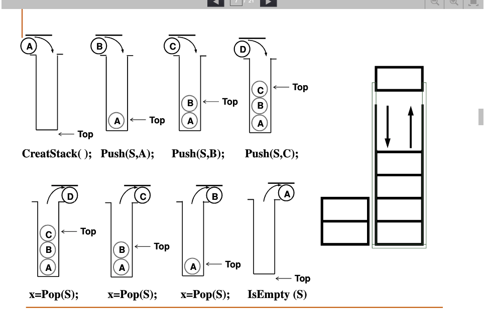

#### 算法学习代码
#####  线性表---- n个元素有序序列
1.  线性表实现方案
-  数组：连续储存空间
-  链表：具有无序性
      - 单向链表
      - 双向链表
      - 循环链表  
2. 堆栈
- 具有一定操作约束的线性表，在一端（栈顶）做插入/删除
- 插入数据：入栈(push)
- 删除数据：出栈(pop)
- 后入先出：Last In First Out(LIFO)
- 描述：一个有零个或者多个元素的有穷线性表
- [堆栈数组实现方案](./heap.js)
  
3. 队列

##### 算法应用代码实现
- [单向概念链表代码实现](./list.js)
- [10进制转换成其他进制](./apply/stackApply.js)
- [parseInt算法模拟](./apply/parseIntMock.js)
- [击鼓传花循环队列](./apply/circularList.js)