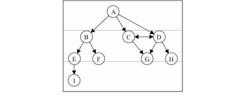
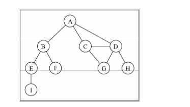
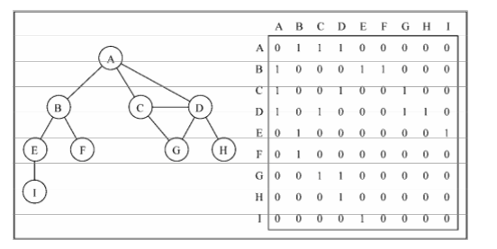
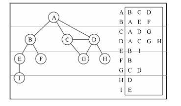
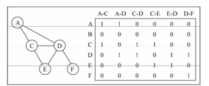

#### [图](./map.js)

- 有向图与无向图：
  - 有向图：有一个方向
    
  - 无向图：无方向
    
- 图的表示：
  - 邻接矩阵：不是强连通的图(稀疏图)如果用邻接矩阵来表示，则矩阵中将会有很多 0，这意味着我们 浪费了计算机存储空间来表示根本不存在的边。图中顶点的 数量可能会改变，而 2 维数组不太灵活。
    
  - 邻接表:邻接表的动态数据结构来表示图;邻接表由图中每个顶点的相邻顶 点列表所组成;用列表(数组)、链表，甚至是 散列表或是字典来表示相邻顶点列表;
    
  - 关联矩阵：关联矩阵中，矩阵的行表示顶点，列表示边;通常用于边的数量比顶点多的情况下，以节省空间和内存
    
- 创建图类：
