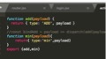

# webapck4.0+react16.0+es6 语法 起步先：

## 部分基础

action 文件的代码：[action](./image/action.jpg)



login.js 文件：

```
const mapDispatchToProps = (dispatch) =>{
	return{
	add:payload=>{dispatch(add(payload))},
	min:payload=>{dispatch(min(payload))}
	}

}
```

- export default connect(mapStateToProps,mapDispatchToProps)(Login);

reducer.js 代码：
;
