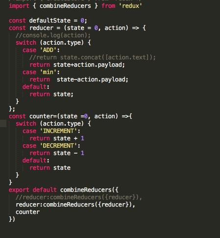

#  webapck4.0+react16.0+es6语法 起步先：

##  部分基础

		"private": true,防止意外发布；
		 babel更新的关键：'babel-preset-es2015' ------->'babel-preset-es2017'
		.babelrc文件变为：es2017
		
				安装scss:   node-sass和sass-loader依赖
		
				{
					test: /\.(css|scss)$/,
					use: [
						'style-loader',
						'css-loader',
						'sass-loader'
					]

				},
				
		
		extract-text-webpack-plugin:css分离插件，只需要将版本定位到^4.0.0-beta.0，就可以
		
		安装方式：cnpm install --save-dev extract-text-webpack-plugin@next
		webpack.ProvidePlugin插件:提供全局变量和方法。
		
		react-router4.0关键点：
		  HashRouter,Route等几个组件
		  单极路由跳转使用‘exact’属性
		  二级路由及多级路由跳转,需要‘strict’属性匹配，必须在一级路由衍生下生成。
		  exact（bool）：为true时，则要求路径与location.pathname必须完全匹配；
			strict（bool）：true的时候，有结尾斜线的路径只能匹配有斜线的location.pathname；
		  		<HashRouter >
			    	<React.Fragment>
					    <Route exact path="/" component={Login}/>
					    <Route strict path="/index"  component={Index}/>
						<Route  path='/index/mine' component={Mine} />
						<Route  path='/index/main' component={Main} />
						<Route  path='/detail' component={Detail} />
					</React.Fragment>
				</HashRouter >
				
		

###  es7语法，class类中加箭头函数，
$ npm install --save-dev babel-preset-stage-0
$ npm install --save-dev babel-preset-stage-1 
$ npm install --save-dev babel-preset-stage-2
$ npm install --save-dev babel-preset-stage-3

##  Redux:基础redux;[api](https://redux.js.org/api)                                        
         页面 -> action({type:a,payload:b}) -> reducer((preState,action)=>{}) -> store({})--connect()-> 页面;

		 涉及界面复杂度(redux-saga)：fetch / api    success/failed	;

1. redux-action;			
			
     未用之前：

     	action文件的代码：;

    	login.js文件：

    		const mapDispatchToProps = (dispatch) =>{
			  return{
			    add:payload=>{dispatch(add(payload))},
			    min:payload=>{dispatch(min(payload))}
			  }
			   
			}

			export default connect(mapStateToProps,mapDispatchToProps)(Login);

		reducer.js代码： ;
		

